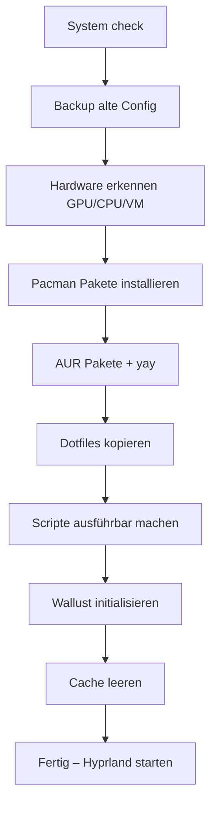

# 🐧 Arch Linux Configuration – TomaKing


---

## 📖 INHALTSVERZEICHNIS

- [📝 PROJEKTBESCHREIBUNG](#-projektbeschreibung)
- [✨ FEATURES](#-features)
- [🚀 TOOL](#-tool)
- [📁 STRUKTUR](#-struktur)
- [🚀 INSTALLATION](#-installation)
- [📦 PAKETMANAGEMENT](#-paketmanagement)
- [⚙️ KONFIGURATION](#️-konfiguration)
- [🎨 WALLPAPER EFFECTS](#wallpaper-effects)
- [🖼️ SCREENSHOTS](#️-screenshots)
- [⚠️ WICHTIGE HINWEISE](#️-wichtige-hinweise)
- [📝 LIZENZ](#-lizenz)
- [👤 AUTOR](#-autor)
- [📊 REPOSITORY STATISTIK](#-repository-statistik)

---

## 📝 PROJEKTBESCHREIBUNG

Willkommen in meiner persönlichen Arch-Linux-Konfiguration – einer sorgfältig kuratierten Sammlung von **Dotfiles**, **Custom Scripts** und **Themes**, die meinen täglichen Workflow auf Hyprland definieren.  
Dieses Repository ist kein generisches Template, sondern der exakte Stand meines Systems: von der Tastaturbelegung über Fensteranimationen bis hin zu den Farben der Statusleiste.

**Warum diese Konfiguration?**  
- Sie zeigt, wie ein modernes, Wayland-basiertes Linux-Desktop-Setup aussehen kann.  
- Sie dient als Dokumentation meiner eigenen Optimierungen und als Inspiration für andere Enthusiasten.  
- Alle Einstellungen sind bewusst kommentiert und in einzelne Module zerlegt, sodass sie leicht verstanden und angepasst werden können.

**Für wen ist das?**  
- Für mich selbst – als Backup und Referenz.  
- Für Arch-Linux-Einsteiger, die ein vollständiges, funktionierendes Beispiel suchen.  
- Für erfahrene Nutzer, die Anregungen für Themes (Anime, Ottoman), Waybar-Styling oder Hyprland-Animationen mitnehmen möchten.

Die Konfiguration wird kontinuierlich weiterentwickelt und an neue Tools sowie meine eigenen Vorlieben angepasst. Wenn du etwas Brauchbares findest, freue ich mich – wenn du Fragen hast, schreib mir einfach.

> Dieses Repository enthält meine persönliche Arch Linux Konfiguration, die vollständig auf Hyprland (Wayland) basiert. Mit der `install.sh` wird das gesamte Setup automatisch installiert – inklusive Hardwareerkennung, Paketinstallation und Dotfiles.

---

## ✨ FEATURES

### 🎨 Visuell & Theming
| Feature | Beschreibung | Status |
|-------|-------------|--------|
| Anime Fastfetch | Custom ASCII Art & Animationen | ✅ |
| Ottoman Empire Theme | Historisches Design | ✅ |
| Rainbow Borders | Dynamische Fensterrahmen | ✅ |
| Hyprland Animations | Flüssige Animationen | ✅ |
| Custom Wallpapers | Dynamische Hintergründe | ✅ |

### ⚡ Performance
| Tool | Vorteil |
|----|--------|
| Hyprland (Wayland) | Performance & Security |
| Kitty | GPU-beschleunigt |
| PipeWire | Low-Latency Audio |
| TUI Tools | Ressourcenschonend |

### 🛠️ Produktivität
| Tool | Zweck |
|----|------|
| Neovim | Code Editor |
| Ranger | File Manager |
| Rofi | App Launcher |
| Waybar | Status Bar |
| Cava | Audio Visualizer |

---

## 🚀 TOOL

| Kategorie | Eingesetzte Werkzeuge |
|-----------|-----------------------|
| 🖥️ Window Manager | Hyprland (Wayland) |
| 🖥️ Terminal | Kitty (GPU-beschleunigt) |
| 📝 Editor | Neovim (LazyVim), Sublime Text |
| 🚀 Launcher | Rofi |
| 📊 Status Bar | Waybar |
| 🎵 Audio | PipeWire, WirePlumber, Cava |
| 🗂️ File Manager | Ranger (TUI) |
| 🎨 Theming | Fastfetch, Wallust, Hyprpaper |
| 🛠️ Scripting | Python, Bash |
| 📦 Paketmanagement | pacman, yay (AUR) |
> 💡 *Alle Konfigurationen sind in den Dotfiles hinterlegt*

---

## 📁 STRUKTUR

### 📂 Hauptverzeichnis
```text
ArchLinux/
├── 📁 .config/                  # Alle Konfigurationsdateien (Hyprland, Waybar, etc.)
├── 📄 .bashrc                   # 🐚 Bash Einstellungen (Aliase, Prompt, etc.)
├── 📄 .bash_logout              # 🐚 Bash Befehle beim Ausloggen
├── 📄 .bash_profile             # 🐚 Bash Profil (wird beim Login ausgeführt)
├── 📄 install.sh                # 🚀 Hauptinstallationsskript (ausführbar)
└── 📄 README.md                 # 📖 Projektdokumentation (diese Datei)
```

## 🎛️ .config/ Ordner Details
```text
🎛️ .config/                       #Ordner Details
├── 🦇 bat/                       # bat (besserer cat) Konfiguration
│   └── config                    # bat Einstellungen
├── 📊 btop/                      # Systemmonitor
│   ├── themes/                   # Farbschemata
│   └── btop.conf                 # Hauptkonfiguration
├── 🎵 cava/                       # Audio Visualizer
│   ├── config                     # Visualizer Einstellungen
│   ├── shaders/                   # GPU Shader Effekte
│   └── themes/                    # Farbschemata
├── 🔔 dunst/                      # Benachrichtigungsdienst
│   └── dunstrc                    # Dunst Konfiguration
├── 🖥️ fastfetch/                  # System Info Tool
│   ├── AsciiArt/                  # ASCII Kunst Frames (auch GIF/MP4)
│   ├── AsciiArtII/                # Weitere Animationen
│   ├── AsciiArtIII/               # Noch mehr Animationen
│   ├── config.jsonc               # Fastfetch Einstellungen
│   └── *.sh                       # Startskripte für ASCII Art
├── 🎨 gtk-3.0/                    # GTK3 Einstellungen
│   └── gtk.css                    # GTK Stylesheet
├── 💧 hypr/                       # Hyprland Fenstermanager
│   ├── LUA/                       # Lua Module (Animationen, Layouts, Regeln)
│   ├── hypridle.conf              # Energiesparen
│   ├── hyprland.lua               # Hauptkonfiguration (Lua)
│   ├── hyprlock.conf              # Sperrbildschirm
│   ├── Hyprlock.png               # Sperrbildschirm Hintergrund
│   └── Ottoman.jpg / .gif         # Wallpaper
├── 🐱 kitty/                      # Terminal Emulator
│   ├── kitty.conf                 # Terminal Einstellungen
│   ├── theme.conf                 # Farbschema
│   └── emoji.sh                   # Emoji Unterstützung
├── 🎬 mpv/                        # Media Player
│   ├── scripts/                   # Zusatzskripte (uosc, sponsorblock, thumbfast)
│   ├── script-opts/               # Optionen für Skripte
│   ├── input.conf                 # Tastenkürzel
│   └── mpv.conf                   # Player Einstellungen
├── 📝 nvim/                       # Neovim IDE
│   ├── lua/                       # Lua Konfiguration (LazyVim)
│   ├── init.lua                   # Hauptkonfiguration
│   └── lazy-lock.json             # Plugin Lockfile
├── 🔊 pulse/                      # PulseAudio Cookie (wird automatisch erstellt)
│   └── cookie                     # PulseAudio Authentifizierung
├── 📁 ranger/                     # TUI File Manager
│   ├── colorschemes/              # Farbschemata
│   ├── plugins/                   # Erweiterungen (ranger_devicons)
│   ├── rc.conf                    # Hauptkonfiguration
│   ├── rifle.conf                 # Dateizuordnungen
│   └── scope.sh                   # Vorschauregeln
├── 🚀 rofi/                       # App Launcher
│   └── config.rasi                # Rofi Layout & Farbschema (aktuell nur eine Datei)
├── 📝 sublime-text/               # Sublime Text Editor
│   ├── Installed Packages/        # Installierte Plugins (Package Control, A File Icon)
│   ├── Packages/                  # Benutzerpakete (Guna Theme, etc.)
│   ├── Local/                     # Sessiondaten
│   └── ...                        # Weitere Sublime Metadaten
├── ⚙️ systemd/                    # Benutzer Systemd Dienste
│   └── user/                      # User Services
│       └── SessionManager.service / .timer
├── 🎨 wallust/                    # Dynamische Farben aus Wallpaper
│   └── wallust.toml               # wallust Konfiguration
├── 📊 waybar/                     # Status Bar
│   ├── config                     # Waybar Module Konfiguration (JSON)
│   ├── style.css                  # CSS Styling
│   └── scripts/                   # Custom Skripte (Brightness, Volume, Cava, Weather, etc.)
├── 📦 yay/                        # Yay Cache (automatisch)
│   └── ...                        # (nicht manuell bearbeiten)
├── 📄 mimeapps.list               # Standardanwendungen für Dateitypen
└── 🚀 starship.toml               # Starship Prompt Konfiguration
```

---

## 🚀 INSTALLATION

### 📥 Repository klonen
```bash
git clone https://github.com/mucahid-emin-tomakin/ArchLinux.git
cd ArchLinux
```

### 🔄 Installationsskript ausführen
```bash
chmod +x install.sh
./install.sh
```
Starte Hyprland mit Hyprland (oder melde dich neu an).
Deine alte Konfiguration wird nach `~/.config/backup_YYYYMMDD_HHMMSS/` gesichert.
> ⚠️ Das Skript ist nur für Arch Linux getestet.
> Es sollte nicht als root ausgeführt werden (sudo wird bei Bedarf abgefragt).

### 🛠️ Was macht die install.sh genau?

| Schritt | Beschreibung |
|---------|--------------|
| **Preflight** | Prüft ob Arch Linux, Internet, Pacman-Keyring, Systemzeit |
| **Backup** | Sichert existierende configs nach `~/.config/backup_*` |
| **Hardware** | Erkennt GPU (NVIDIA, AMD, Intel, VMware, VBox) und CPU (Intel/AMD) für optimierte Treiber/Mikrocode |
| **Pakete** | Installiert alle oben gelisteten Tools sowie die Hardware‑abhängigen Pakete |
| **AUR** | Installiert `yay` (falls fehlt) sowie `awww`, `pulsemixer`, `sublime-text`, `google-chrome`, `ascii-image-converter-git`, `wallust` |
| **Dotfiles** | Kopiert alle Dateien/Ordner aus dem Repo nach `$HOME` (rsync oder fallback cp) |
| **Skripte** | Macht alle `.sh` Dateien in `~/.config` ausführbar |
| **Wallust** | Generiert Farben aus `~/.config/hypr/ottoman.jpg` (falls vorhanden) |
| **Abschluss** | Fragt optional, ob Hyprland gestartet werden soll |

### 🧩 Anpassungen nach der Installation
- **Wallpaper & Farben**  
  Lege ein Bild in `~/.config/hypr/` ab (z.B. `mywall.jpg`) und führe aus:
  ```bash
  wallust run ~/.config/hypr/mywall.jpg -s
  ```
- **Waybar Module**  
  Die Skripte findest du in `~/.config/waybar/scripts/`. Hier kannst du z.B. das Wetter‑Script an deine Region anpassen.
- **Hyprland Keybindings**  
  Bearbeite `~/.config/hypr/hyprland.conf` oder die LUA‑Module unter `~/.config/hypr/LUA/`.
- **Fastfetch ASCII‑Art**  
  Die Frames liegen in `~/.config/fastfetch/AsciiArt/` – du kannst eigene `.txt` oder `.gif` (mit `awww`) einbinden.
- **Neue AUR Pakete nachinstallieren**  
  ```bash
  yay -S --needed paketname
  ```

### ❗ Troubleshooting
| Problem | Lösung |
|---------|--------|
| Hyprland startet nicht (schwarzer Bildschirm) | Cache löschen: `rm -rf ~/.cache/hyprland` – dann `Hyprland` nochmal starten. |
| Kein Audio | Prüfe `pactl info` und starte ggf. `systemctl --user restart pipewire` |
| Waybar zeigt keine Icons | Nerd Fonts installiert? Stelle sicher, dass `ttf-jetbrains-mono-nerd` installiert ist. |
| Wallust generiert keine Farben | Stelle sicher, dass `wallust` installiert ist und ein Bild in `~/.config/hypr/` liegt. |
| NVIDIA Wayland Probleme | Überprüfe den Kernel Parameter `nvidia_drm.modeset=1` und die `egl-wayland` Pakete. |
| Skriptabbruch (Netzwerkfehler, manueller Abbruch) | Starte `./install.sh` einfach erneut. Das Skript ist idempotent und setzt an der unterbrochenen Stelle fort. |

---

## 📦 Paketmanagement

Dieses Setup basiert auf **Arch Linux** und verwendet `pacman` für offizielle Pakete sowie `yay` für AUR.

### 📋 Übersicht nach Kategorien
| Kategorie | Pakete |
|-----------|--------|
| **Hyprland & Wayland** | `hyprland`, `hyprlock`, `hypridle`, `hyprpolkitagent`, `xdg-desktop-portal-hyprland` |
| **Statusleiste** | `waybar`, `cava` |
| **Terminal & Shell** | `kitty`, `starship`, `btop`, `nvtop`, `ranger`, `eza`, `fzf`, `lolcat`, `bat` |
| **Audio** | `pipewire`, `wireplumber`, `pamixer`, `playerctl`, `pulsemixer` |
| **System & Tools** | `dunst`, `rofi`, `wallust`, `grim`, `imagemagick`, `jq`, `brightnessctl`, `bluez`, `blueman`, `wl-clipboard`, `trash-cli`, `cups` |
| **Entwicklung & Bauen** | `nvim`, `git`, `base-devel`, `cmake`, `python-pillow` |
| **AUR (Helfer & Extras)** | `yay`, `awww`, `sublime-text`, `google-chrome`, `ascii-image-converter-git` |
| **Media & Grafik** | `mpv`, `mpvpaper`, `ffmpeg`, `ffmpegthumbnailer` |
| **Schriftarten** | `ttf-jetbrains-mono-nerd`, `ttf-liberation`, `ttf-opensans`, `noto-fonts`, `noto-fonts-emoji`, `noto-fonts-cjk` |
| **Sonstiges** | `fastfetch`, `discord`, `obs-studio` |

### 🎯 Detaillierte Beschreibung (Zweck)
| Paket | Zweck in meinem Setup |
|-------|------------------------|
| `hyprland` | Wayland‑Kompositor |
| `hyprlock`, `hypridle`, `hyprpolkitagent` | Sperrbildschirm, Energiesparen, Polkit‑Dialog |
| `waybar` | Statusleiste (mit cava‑Modul) |
| `rofi` | Anwendungsstarter, Fensterumschalter |
| `kitty` | Terminal‑Emulator (eigene Theme) |
| `dunst` | Benachrichtigungsdienst |
| `starship` | Prompt‑Konfiguration |
| `fastfetch` | Systeminfo mit ASCII‑Art (eigene Frames) |
| `cava` | Audio‑Visualizer für Waybar |
| `btop`, `nvtop` | System‑ und GPU‑Monitoring |
| `grim`, `imagemagick`, `jq` | Screenshots, Bildbearbeitung, JSON‑Parsing |
| `playerctl`, `pamixer`, `brightnessctl` | Media‑Tasten, Lautstärke, Helligkeit |
| `bluez`, `blueman` | Bluetooth (Integration in Waybar) |
| `ttf-jetbrains-mono-nerd` | Hauptschriftart (Icons) |
| `noto-fonts*` | Fallback‑Fonts für Emojis & CJK |
| `pipewire`, `wireplumber` | Audio‑Stack (für cava und mpv) |
| `xdg-desktop-portal-hyprland` | Screen‑Sharing, Dateidialoge |
| `mpv`, `mpvpaper` | Video‑Player, animierte Wallpaper |
| `ranger` | Dateimanager im Terminal |
| `nvim` | Editor (LazyVim‑Config) |
| `bat`, `eza`, `fzf`, `lolcat` | Bessere `cat`, `ls`, Fuzzy‑Finder, Regenbogen‑Effekte |
| `wl-clipboard` | Zwischenablage (Waybar‑Scripts) |
| `trash-cli` | Papierkorb im Terminal |
| `cups` | Druckerunterstützung (optional) |
| `base-devel`, `git`, `cmake`, `python-pillow` | Bauen von AUR‑Paketen & Wallust‑Farbgenerierung |
| `awww` | ASCII‑Art‑Animationen in Fastfetch |
| `pulsemixer` | CLI‑Mixer für Waybar‑Scripts |
| `sublime-text` | Alternativer Editor |
| `google-chrome` | Browser |
| `ascii-image-converter-git` | Bilder in ASCII umwandeln (für Fastfetch) |
| `wallust` | Dynamische Farben basierend auf Wallpaper |
> 💡 **GPU‑, CPU‑ und VM‑spezifische Pakete** (z.B. `nvidia-open`, `intel-ucode`, `virtualbox-guest-utils`) werden automatisch anhand deiner Hardware installiert – du musst dich nicht darum kümmern.

### 📊 Paketstatistiken
```bash
🏛️  Offizielle Pakete: 757
🎁 AUR Pakete: 8
📦 Gesamt: 765
```

### 📊 Vollständige Paketliste
```bash
# Offizielle Pakete zählen
pacman -Q | wc -l
# AUR Pakete zählen
pacman -Qm | wc -l
```

📄 Meine komplette Paketliste findest du hier: [Packages.txt](https://github.com/mucahid-emin-tomakin/ArchLinux/blob/main/Packages.txt)

---

## ⚙️ KONFIGURATION

### 💧 Hyprland (Lua‑Konfiguration)
Deine Hyprland‑Einstellungen sind in `~/.config/hypr/hyprland.lua` sowie den Modulen in `~/.config/hypr/LUA/` organisiert.
```lua
hl.on("hyprland.start", function()
    hl.exec_cmd("dunst")
    hl.exec_cmd("sh -c 'while ! pactl info >/dev/null 2>&1; do sleep 1; done; waybar'")
    hl.exec_cmd("awww-daemon &")
    hl.exec_cmd("hyprctl setcursor Bibata-Modern-Ice 24")
    hl.exec_cmd("sleep 5 && awww img ~/.config/hypr/Wallpaper.gif")
    hl.exec_cmd("dbus-update-activation-environment --systemd WAYLAND_DISPLAY XDG_CURRENT_DESKTOP")
    hl.exec_cmd("sleep 11 && ~/.config/systemd/user/SessionManager.sh --restore")   
end)
```

### 📊 Waybar – Statusleiste
Die Konfiguration liegt in `~/.config/waybar/config`, `~/.config/waybar/modules` und `~/.config/waybar/style.css`.
```css
#waybar {
    background-color: rgba(40, 42, 54, 0.9);
    border-radius: 10px;
    margin: 5px;
    padding: 0 10px;
}
#workspaces button {
    padding: 0 5px;
    background: transparent;
    color: #f8f8f2;
    border-radius: 5px;
}
#workspaces button.active {
    background: #6272a4;
}
```

### 🖥️ Kitty – Terminal
Die Einstellungen findest du in `~/.config/kitty/kitty.conf`, `~/.config/kitty/theme.conf` und `~/.config/kitty/emoji.sh`.
```conf
# ⚡ Performance Einstellungen
  scrollback_lines 10000
  repaint_delay 10
  input_delay 3
  sync_to_monitor yes
# 🎨 Farbschema (aus theme.conf)
  foreground #f8f8f2
  background #282a36
  selection_foreground #ffffff
  selection_background #44475a
```

### 🖋️ Neovim (LazyVim)
Deine Neovim‑Konfiguration basiert auf LazyVim und liegt in `~/.config/nvim/`.
Der Lazy.nvim‑Bootstrapping‑Code in `init.lua`:
```lua
-- 🚀 Lazy.nvim Plugin Manager
  local lazypath = vim.fn.stdpath("data") .. "/lazy/lazy.nvim"
  if not vim.loop.fs_stat(lazypath) then
    vim.fn.system({
      "git",
      "clone",
      "--filter=blob:none",
      "https://github.com/folke/lazy.nvim.git",
      "--branch=stable",
      lazypath,
    })
  end
  vim.opt.rtp:prepend(lazypath)
```

### 🛠️ Eigene Waybar‑Skripte (in ~/.config/waybar/scripts/)
| Skript | Beschreibung |
|--------|--------------|
| `Brightness.sh` | Helligkeit anzeigen / steuern (für Waybar‑Modul) |
| `Clean.sh` | Cache / temporäre Dateien aufräumen |
| `HyprlockBG.sh` | Hintergrundbild für Hyprlock setzen |
| `KeyBinds.sh` | Tastenkürzel anzeigen (z. B. mit `rofi` oder `notify-send`) |
| `KeyHints.sh` | Hilfetext für häufig genutzte Tasten |
| `LockScreen.sh` | Bildschirm sperren (Hyprlock) |
| `UptimeNixOS.sh` | System‑Uptime anzeigen |
| `Volume.sh` | Lautstärkeregelung (`pamixer`) für Waybar |
| `WallpaperEffects.sh` | ImageMagick‑Effekte + `awww` + `wallust` – siehe separater Abschnitt |
| `WaybarCava.sh` | Cava‑Visualizer in Waybar einbinden (Farben von `wallust`) |
| `Weather.sh` | Wetterabfrage (`wttr.in`) mit Icons |
| `Wlogout.sh` | Abmelde‑/Herunterfahr‑Menü (`wlogout`) |

### 🌈 WallpaperEffects.sh
```bash
# 17 verschiedene ImageMagick‑Effekte (z. B. Black & White, Blurred, Oil Paint, Polaroid, Sepia, Vignette)
# Sanfte awww‑Übergänge (einstellbar: Dauer, FPS, Bézier‑Kurve, Winkel)
# Automatische Farbübernahme in Waybar (Cava + style.css) via wallust
# Rofi‑Auswahlmenü mit Anzeige des aktuellen Effekts
# Ton bei Fertigstellung
```
> 💡 Tipp: Rufe das Skript per Tastenkürzel in Hyprland auf.

### ☁️ Weather.sh
Dein Wetter‑Skript ruft `wttr.in` ab und zeigt Temperatur mit passendem Icon an.
```bash
# Auszug Weather.py (äquivalent zu deinem Weather.sh)
icons = {"Sunny": "☀️", "Clear": "🌙", "Cloudy": "☁️", "Rain": "🌧️", "Snow": "❄️"}
# Gibt z. B. "☀️ 22°C" zurück
```

---

<a id="wallpaper-effects"></a>
## 🎨 Wallpaper Effects (WallpaperEffects.sh)

Dein interaktives Skript zur dynamischen Wallpaper‑Bearbeitung mit ImageMagick, awww-Animationen und wallust-Farbanpassung.

### 🖼️ Verfügbare Effekte
| Effekt | Beschreibung |
|--------|--------------|
| **No Effects** | Originalbild (keine Veränderung) |
| **Black & White** | Schwarz/Weiß mit Kontrastanpassung |
| **Blurred** | Weichzeichnung (10px Radius) |
| **Charcoal** | Kohlezeichnungs‑Effekt |
| **Edge Detect** | Kantenerkennung |
| **Emboss** | Relief / Geprägt |
| **Frame Raised** | Erhöhter Rahmen (150px) |
| **Frame Sunk** | Vertiefter Rahmen |
| **Negate** | Negative Farben |
| **Oil Paint** | Ölgemälde‑Effekt |
| **Posterize** | Posterisierung (4 Stufen) |
| **Polaroid** | Polaroid‑Look |
| **Sepia Tone** | Sepia (altes Foto) |
| **Solarize** | Solarisation |
| **Sharpen** | Schärfung |
| **Vignette** | Vignette (dunkle Ränder) |
| **Vignette‑black** | Vignette mit schwarzem Hintergrund |
| **Zoomed** | Zentrierter Zuschnitt (1:1) |

### ✨ Zusätzliche Features
- **awww‑Animationen** – Sanfte Übergänge zwischen Wallpapern (einstellbar: Dauer, FPS, Bézier‑Kurve, Winkel)
- **wallust‑Integration** – Automatische Farbgenerierung aus dem bearbeiteten Bild, inkl. Anpassung von:
  - Waybar‑Cava‑Farben
  - Waybar‑Style.css (alle definierten `@define-color` Variablen)
- **GIF / MP4 Unterstützung** – Animierte Wallpaper mit `awww` (fps, Dauer, Bezier)
- **Rofi‑Menü** – Grafische Auswahl aller Effekte mit Statusanzeige
- **Cache** – Zuletzt verwendeter Effekt wird in `~/.cache/wallpaper_effect` gespeichert
- **Ton** – Abschlussbestätigung per Systemklang (`complete.oga`)

### 🚀 Verwendung
```bash
# Skript ausführbar machen (falls nicht bereits geschehen)
chmod +x ~/.config/waybar/scripts/WallpaperEffects.sh

# Starten (z. B. per Tastenkürzel oder Terminal)
~/.config/waybar/scripts/WallpaperEffects.sh
```

---

## 🖼️ SCREENSHOTS

### 💧 Window Manager (Hyprland)
### 🐱 Kitty Terminal
### 🎬 MPV Player
### 🖥️ Multitasking
### 📁 Ranger Dateimanager
### 🚀 Rofi Launcher
### 📝 Sublime Text
### 🖋️ Neovim (LazyVim)
### 🌐 Wayland Übersicht

---

## ⚠️ WICHTIGE HINWEISE

### 🔒 Sicherheit
- Diese Konfiguration ist hochgradig persönlich angepasst
- Überprüfe Skripte vor der Ausführung
- Erstelle ein Backup vor großen Änderungen
- Nicht auf Produktivsystemen ohne vorheriges Testing verwenden

### 💡 Empfehlungen
- **Testing** – In VM oder auf Testsystem zuerst ausprobieren
- **Backup** – Eigene Konfigurationen vorher sichern
- **Anpassen** – Auf eigene Hardware/Präferenzen anpassen
- **Lernen** – Verstehen, was jede Konfiguration macht

---

## 📝 LIZENZ

  Dieses Projekt ist unter der **MIT License** lizenziert - frei für persönliche und kommerzielle Nutzung.

---

## 👤 AUTOR

**Mücahid Emin Tomakin (TomaKing)**

| Platform | Link | Icon |
|----------|------|------|
| **GitHub** | [@mucahid-emin-tomakin](https://github.com/mucahid-emin-tomakin) | 🐙 |
| **Arch Linux** | Enthusiast & Customization Lover | 🐧 |
| **Interessen** | Linux, Programming, Anime, History | 💻 |

**Über dieses Repository:**
- 🎯 **Ziel:** Persönliche Linux-Konfiguration teilen
- 📚 **Lernressource:** Für Arch Linux Einsteiger
- 🎨 **Inspiration:** Custom Themes und Designs
- 🔧 **Werkzeuge:** Optimierte Development Environment

---

## 📊 REPOSITORY STATISTIK

| Metrik | Wert | Trend |
|--------|------|-------|
| **Stars** |  | 📈 |
| **Forks** |  | 🔄 |
| **Issues** |  | ✅ |
| **Letztes Update** |  | 🕐 |

---

### 🔧 Made with ❤️ on Arch Linux
